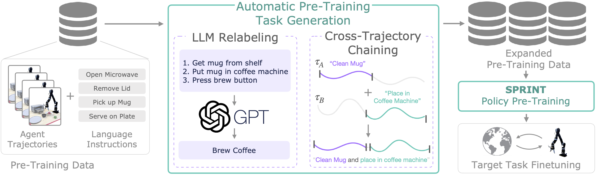
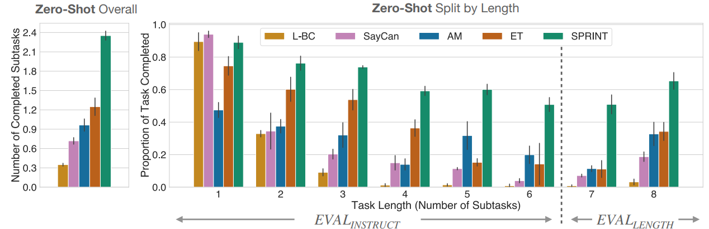
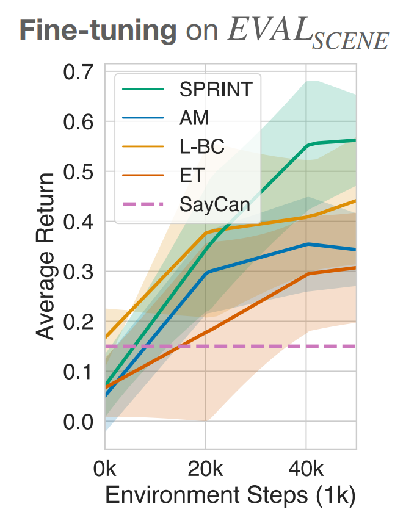

# SPRINT: Scalable Semantic Policy Pre-training via Language Instruction Relabeling
[[Project Website]](https://clvrai.github.io/sprint/) [[Paper]](https://arxiv.org/abs/2306.11886)

[Jesse Zhang](https://jesbu1.github.io/)<sup>1</sup>, [Karl Pertsch](https://kpertsch.github.io/)<sup>2,3</sup>, [Jiahui Zhang](https://jiahui-3205.github.io/)<sup>1</sup>, [Joseph J. Lim](https://clvrai.com/web_lim/)<sup>4</sup>

<sup>1</sup>University of Southern California 
<sup>2</sup>UC Berkeley
<sup>3</sup>Stanford University
<sup>4</sup>KAIST


<a href="docs/static/images/sprint_teaser_horizontal.png">
<p align="center">

</p>
</img></a>

This is the official PyTorch implementation of the paper "**SPRINT: Scalable Semantic Policy Pre-training via Language Instruction Relabeling**"
(ICRA 2024).

# Running the code

This is the code for running simulated experiments on our ALFRED-RL task benchmark.

## 1. Setting up the environment

### 1.1 Installing Dependencies
The environment can be installed either through pip or conda.

Pip install:
```
pip3 install -r requirements.txt
```
OR

Conda install:
```
conda env create -f environnment.yml
```

Then, you must pip install the sprint package:
```
pip install -e .
```

The [ALFRED](askforalfred.com) environment requires some additional dependencies -- installing may require sudo access. Read the [ALFRED README](alfred/README.md) for more details if this doesn't work:
```
cd sprint/alfred/scripts
sh install_deps.sh
```

### 1.2 WandB setup
All results will be written to [WandB](https://www.wandb.com/). Before running any of the commands below, create an account and then change the WandB entity and project name at the top of [`sprint/utils/wandb_info.py`](sprint/utils/wandb_info.py) to match your account and name for the project holding the runs for this repo.

### 1.3 SPRINT Environment Variable
Add the location in which you git cloned SPRINT to your `~/.bashrc`:
```
export SPRINT=[SPRINT_DOWNLOAD_LOCATION]
```

## 2. Downloading the data
### 2.1 Model Training Data
You need to pre-train models to run zero-shot or finetuning experiments. 
If you don't want to pre-train a model yourself, you can skip to step 3 as you don't need the pre-training dataset file. 

Download the ALFRED dataset here: [Google Drive Link](https://drive.google.com/file/d/1ZgKDgG9Fv491GVb9rxIVNJpViPNKFWMF).

You can use [Gdown](https://github.com/wkentaro/gdown) to directly download the dataset to your server/computer at the desired location (18GB download):
```
cd [SPRINT_REPO_LOCATION]
mkdir data
cd data
pip3 install gdown
gdown 1ZgKDgG9Fv491GVb9rxIVNJpViPNKFWMF
```

Once the dataset is downloaded (`px_llama_13b.tar.gz`) simply untar it (36GB after extraction): 

``` 
tar -xvzf px_llama_13b.tar.gz
```
### 2.2 ALFRED Evaluation Data
To run evals and fine-tuning experiments, you must extract ALFRED evaluation data we have processed ([Google Drive Link](https://drive.google.com/file/d/1MHDrKSRmyag-DwipyLj-i-BbKU_dxbne/view)):

```
cd [SPRINT_REPO_LOCATION]
cd sprint/alfred/data
gdown 1MHDrKSRmyag-DwipyLj-i-BbKU_dxbne
tar -xvzf json_2.1.0_merge_goto.tar.gz
```

## 3. Setting up WandB
We log using WandB. First create a wandb account if you don't already have one [here](https://wandb.ai).
Then, run `wandb login` to login to your account on the machine.

Finally, fill in `WANDB_ENTITY_NAME, WANDB_PROJECT_NAME` in the file `utils/wandb_info.py` where `WANDB_ENTITY_NAME` refers to your wandb account name and `WANDB_PROJECT_NAME` is the name of the wandb project you want to log results to.


## 4. Pre-training a Model
You can either pre-train a model yourself or download a pre-trained checkpoint. Pre-trained model checkpoints can be found here: [Google Drive Link](https://drive.google.com/file/d/1PDNX7Z1BBoB3pmeBTfOgNxe2I53kUoS0/view).

Otherwise, run the following command from the base SPRINT repo location to train our model, SPRINT:

```
python sprint/pretrain.py --experiment_name [WANDB_EXP_NAME] --run_group [WANDB_RUN_GROUP] --model sprint 
```

`--experiment_name` and `--run_group` are used to name the experiment and group of runs in WandB. Experiments in the same `run_group` will appear grouped together on wandB for easier comparison, but this command is completely optional.

To run a language conditioned BC policy (L-BC in the paper) on primitive skill labels, run
```
python sprint/pretrain.py --experiment_name [WANDB_EXP_NAME] --run_group [WANDB_RUN_GROUP] --sample_primitive_skill True --epochs 135 --save_frequency 15 --train_with_advantage False  --chain_multi_trajectory False
```

To run a basic IQL offline RL policy on primitive skill labels (L-BC used for finetuning experiments in the paper), run
```
python sprint/pretrain.py --experiment_name [WANDB_EXP_NAME] --run_group [WANDB_RUN_GROUP] --sample_primitive_skill True --epochs 135 --save_frequency 15 --chain_multi_trajectory False
```

To run [Actionable Models](https://actionable-models.github.io/), run
```
python sprint/pretrain.py --experiment_name [WANDB_EXP_NAME] --run_group [WANDB_RUN_GROUP] --model am 
```

To run [Episodic Transformers](https://arxiv.org/abs/2105.06453), run 
```
python sprint/pretrain.py --experiment_name [WANDB_EXP_NAME] --run_group [WANDB_RUN_GROUP] --use_llm_labels False
```

All models are saved to `saved_models/` by default. You can add a `--save_dir` command to specify a different location.

## 5. Running Finetuning/Zero-shot Learning Experiments
<a href="docs/static/images/sprint_zero_shot_eval.png">
      <p align="center">
            
            </img>
      </p>
</a>

### Starting ALFRED
To run the ALFRED environment, you must first start the X server to render the environment. This can be done by running the following command in a separate tmux window (it must stay running):
```
sudo python3 sprint/alfred/scripts/startx.py 2
```
where `2` refers to the X display. If this doesn't work, try other X display numbers (2, 3, 4, etc.) and change the `DISPLAY` environment variable in [`sprint/alfred/gen/constants.py`](sprint/alfred/gen/constants.py) to match the display number you are using.
For more details or help, see the [ALFRED README and Repo](https://github.com/askforalfred/alfred).

### Warning: Hanging Processes!!
Running these scripts uses python multithreading, and there can be hanging processes.`ctrl+c` should work to kill the process but if it is run while the agent is executing in the environment with multiple threads, the processes need to finish executing before being killed. It may be easier to just `ctrl+z` and then run `ps` to check if there are hanging Ai2Thor processes and run `kill -9 %` to kill all associated ones in the current terminal window.

### Running Zero-shot Evaluations
Zero-shot evaluations can be run with the following command for all methods except SayCan, a curve of `eval_subgoal_success` and `eval_average_return` will be plotted on WandB with the x-axis corresponding to # of training batches:
```
python sprint/eval.py --model_checkpoint_dir [SAVED_CHECKPOINT_FOLDER] --env_type {eval_instruct, eval_length, eval_scene} --run_group [RUN_GROUP] --experiment_name [EXP_NAME]
```
Simply change the `env_type` to specify which eval environment set to evaluate on. In the paper, we do zero-shot evaluations on `eval_instruct` and `eval_length`.

Checkpoints are saved in `sprint_saved_rl_models/`


To run SayCan zero-shot evals, pre-train the L-BC baseline above and then:
```
python sprint/saycan_eval.py --model_checkpoint_dir [L-BC PATH] --env_type {eval_instruct, eval_length, eval_scene} --run_group [RUN_GROUP] --experiment_name [EXP_NAME] --llm_gpus [GPU]
```
The optional `llm_gpus` flag allows you to input a comma separated list of GPU IDs to put the LLM onto since it might be too big to fit on the same GPU as the model.

The 13b llama model we used is no longer available on huggingface, so to fully reproduce this you should follow the llama instructions to download LLaMA-13B. 
Right now this script defaults to LLaMA-7B, but the empirically the performance is very similar.


### RL Fine-tuning

<a href="docs/static/images/sprint_finetune.png">
      <p align="center">
            
            </img>
      </p>
</a>


Finally, the last set of fine-tuning experiments can be reproduced with the following line for SPRINT, L-BC, Actionable Models, or Episodic Transformers:

```
python sprint/finetune.py --model_checkpoint_dir [SAVED_CHECKPOINT_FOLDER] --env_type eval_scene --specific_task [TASK_ID] --run_group [RUN_GROUP] --experiment_name [EXP_NAME]
```
In the paper, we perform RL finetuning to `eval_scene` as these ALFRED floorplans are not seen anywhere in the training dataset.

`--specific_task` specifies the task id. In the paper we fine-tune all methods to all 10 tasks in `eval_scene` individually and then average the results, so you can run the above command 10 times with `TASK_ID` ranging from 0 to 9. 

For example, to run on all:
```
for i in {0..9}; do python sprint/finetune.py --model_checkpoint_dir [SAVED_CHECKPOINT_FOLDER] --env_type eval_scene --specific_task $i --run_group [RUN_GROUP]_$i --experiment_name [EXP_NAME]_$i; done
```

# Citation
If you find this work useful, please cite it:
```
@inproceedings{zhang2024sprint,
      title={SPRINT: Scalable Policy Pre-Training via Language Instruction Relabeling}, 
      author={Jesse Zhang and Karl Pertsch and Jiahui Zhang and Joseph J. Lim},
      year={2024},
      booktitle=ICRA,
      url={https://arxiv.org/abs/2306.11886}
}
```