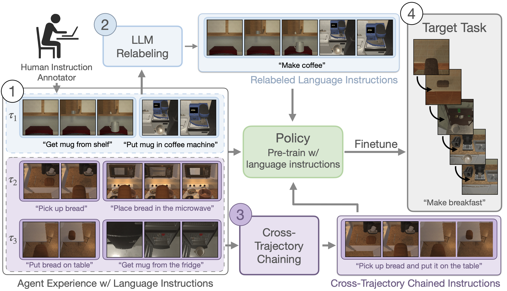

# SPRINT: Scalable Semantic Policy Pre-training via Language Instruction Relabeling
[[Project Website]](https://clvrai.github.io/sprint/) [[Paper]](https://arxiv.org/abs/)

[Jesse Zhang](https://jesbu1.github.io/)1, [Karl Pertsch](https://kpertsch.github.io/)1, [Jiahui Zhang](https://jiahui-3205.github.io/)1, [Joseph J. Lim](https://clvrai.com/web_lim/)2

1University of Southern California 
2KAIST

<a href="docs/static/images/sprint.png">

</img></a>

This is the official PyTorch implementation of the paper "**SPRINT: Scalable Semantic Policy Pre-training via Language Instruction Relabeling**"

CODE coming soon!
